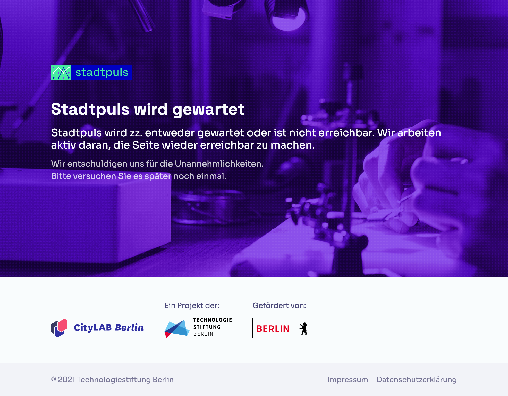

# **Stadtpuls** maintenance page

A vanilla HTML/JS/CSS page for indicating when **[stadtpuls.com](https://stadtpuls.com)** is down or in maintenance.

## What is **Stadtpuls** ?

**Stadtpuls** (german for "city pulse") is Berlin's open platform for sensor data. Hardware hobbyists, activists, public institutions but also businesses can use **Stadtpuls** to share their sensor data to the world and enable others to leverage it for other purposes. Think of it as the GitHub for sensor data.

**Stadtpuls** is an open source project by the [CityLAB Berlin](https://www.citylab-berlin.org/), a project of the [Technologiestiftung Berlin](https://github.com/technologiestiftung), supported by the [Senate Chancellery Berlin](https://www.berlin.de/rbmskzl/en/).

## About the code

This repo requires neither NodeJS nor a build tool. It is intentionally [_**vanilla**_](https://en.wikipedia.org/wiki/Vanilla_software) in order to make it easier for anybody with basic HTML/CSS/JavaScript skills to dive straight into the code.

It does, however, import some external CSS stylesheets and JavaScript scripts for convenience. Those are:

- [**Tailwind Preflight**](https://tailwindcss.com/docs/preflight): A CSS reset setup created by TailwindCSS build on top of [modern-normalize](https://github.com/sindresorhus/modern-normalize).

## Contributors

Thanks goes to these wonderful people ([emoji key](https://allcontributors.org/docs/en/emoji-key)):

<!-- ALL-CONTRIBUTORS-LIST:START - Do not remove or modify this section -->
<!-- prettier-ignore-start -->
<!-- markdownlint-disable -->
<table>
  <tr>
    <td align="center"><a href="https://vogelino.com/"> <b>Lucas Vogel</b></a> <a href="https://github.com/technologiestiftung/stadtpuls-maintenance-page/commits?author=vogelino" title="Code">💻</a> <a href="#design-vogelino" title="Design">🎨</a> <a href="https://github.com/technologiestiftung/stadtpuls-maintenance-page/commits?author=vogelino" title="Documentation">📖</a></td>
    <td align="center"><a href="https://github.com/dnsos"> <b>Dennis Ostendorf</b></a> <a href="https://github.com/technologiestiftung/stadtpuls-maintenance-page/pulls?q=is%3Apr+reviewed-by%3Adnsos" title="Reviewed Pull Requests">👀</a></td>
    <td align="center"><a href="http://www.awsm.de/"> <b>Ingo Hinterding</b></a> <a href="https://github.com/technologiestiftung/stadtpuls-maintenance-page/pulls?q=is%3Apr+reviewed-by%3AEsshahn" title="Reviewed Pull Requests">👀</a></td>
    <td align="center"><a href="https://fabianmoronzirfas.me/"> <b>Fabian Morón Zirfas</b></a> <a href="https://github.com/technologiestiftung/stadtpuls-maintenance-page/pulls?q=is%3Apr+reviewed-by%3Aff6347" title="Reviewed Pull Requests">👀</a></td>
  </tr>
</table>

<!-- markdownlint-restore -->
<!-- prettier-ignore-end -->

<!-- ALL-CONTRIBUTORS-LIST:END -->

This project follows the [all-contributors](https://github.com/all-contributors/all-contributors) specification. Contributions of any kind welcome!

## Content Licencing

Texts and content available as [CC BY](https://creativecommons.org/licenses/by/3.0/de/).

## Credits

<table>
  <tr>
    <td>
      <a src="https://citylab-berlin.org/de/start/">
         
         
        
      </a>
    </td>
    <td>
      A project by <a src="https://www.technologiestiftung-berlin.de/">
         
         
        
      </a>
    </td>
    <td>
      Supported by <a src="https://www.berlin.de/rbmskzl/">
         
         
        
      </a>
    </td>
  </tr>
</table>

